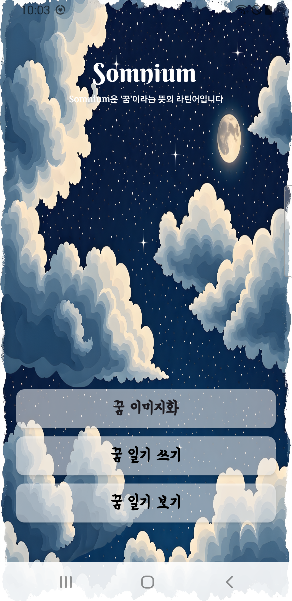
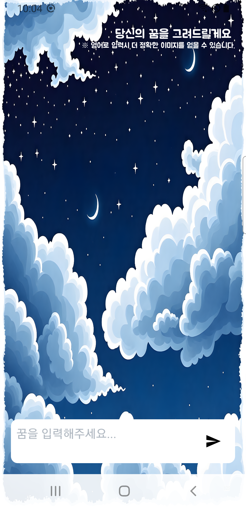
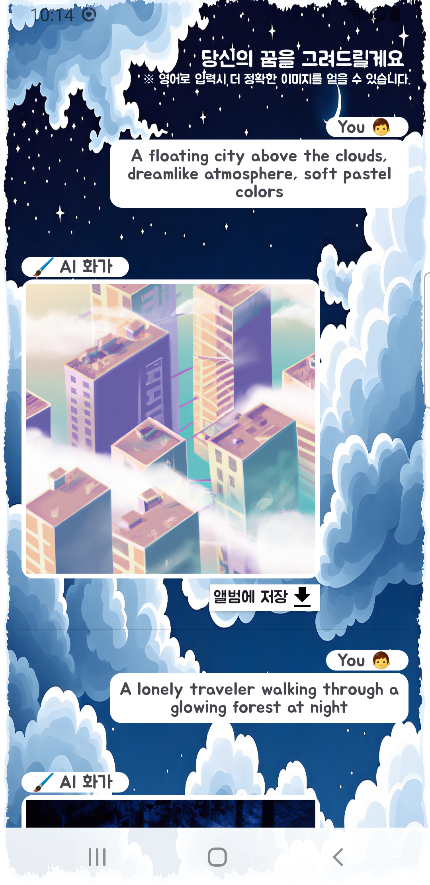
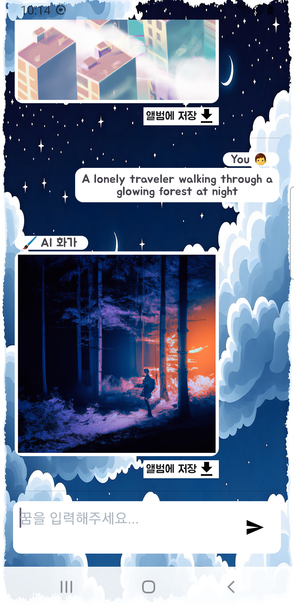
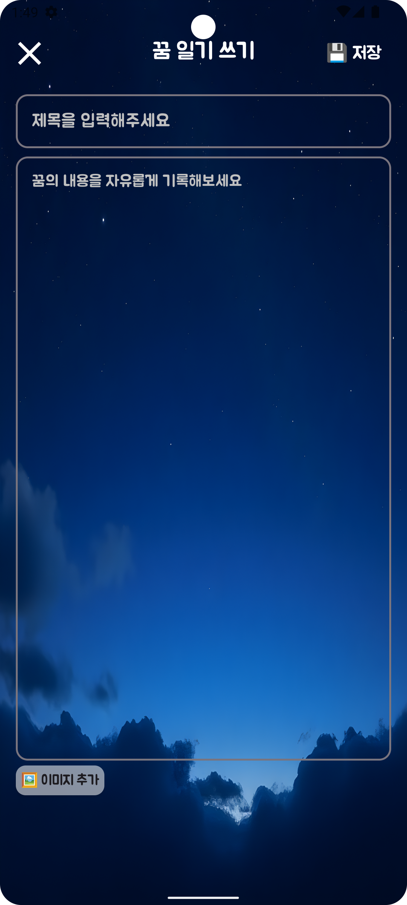
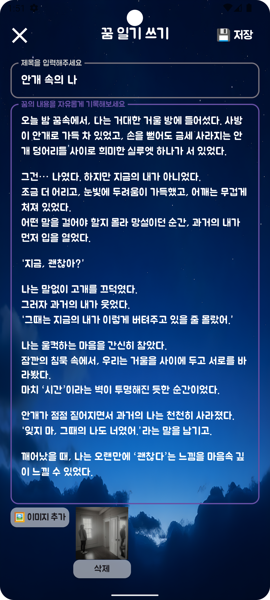
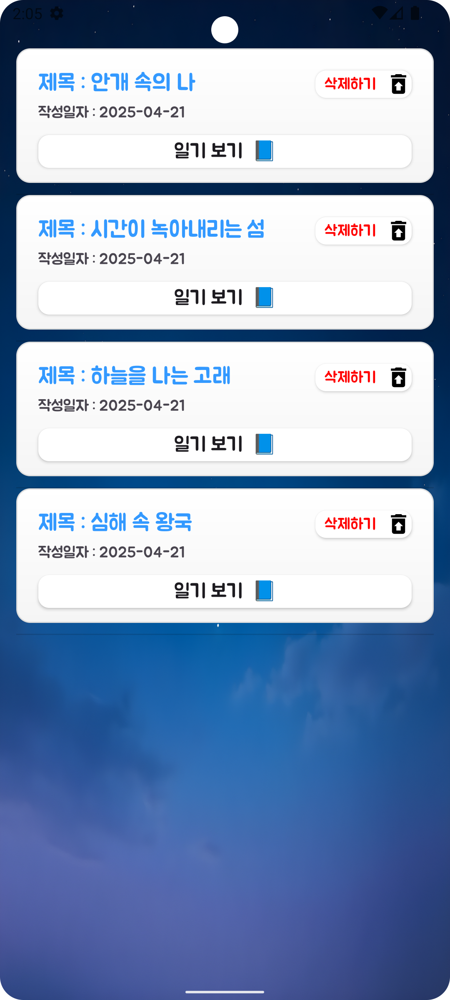
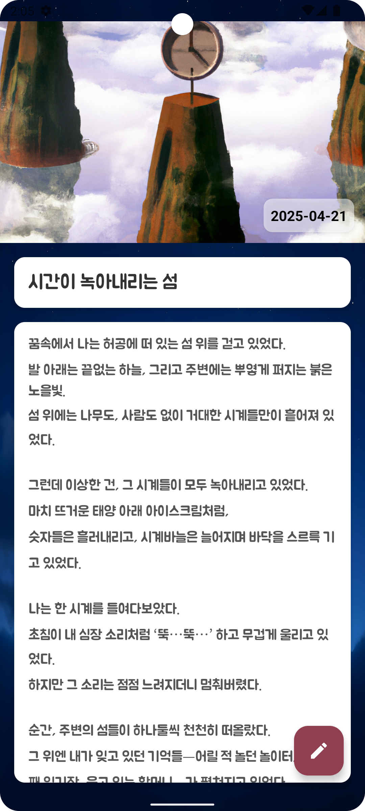
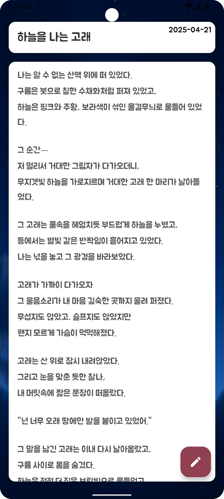

# 🌙 Project Name : Somnium

## 📌 설명  
**Somnium**은 사용자가 꾼 **꿈의 내용을 글로 작성하면**, Open API인 **DALL·E 모델**을 통해 그 꿈에 어울리는 이미지를 자동 생성해주는 **꿈 일기 앱**입니다.  
생성된 이미지를 배경으로 일기를 작성하며, 자신만의 몽환적인 꿈 일기장을 만들어 갈 수 있습니다.

---

## ✨ 주요 기능

### 🎨 AI 이미지 생성 (DALL·E)
- 사용자가 입력한 꿈 내용을 바탕으로 OpenAI의 **DALL·E 모델을 통해 이미지 생성**
- 생성된 이미지를 기반으로 꿈 일기를 작성할 수 있습니다.
  
### 📖 꿈 일기 작성/수정/삭제 기능  
- **텍스트 + 이미지 조합**으로 일기 작성  
- 작성된 꿈 일기는 목록에서 확인 및 편집 가능  

### 📑 꿈 일기 리스트 및 상세 보기
- RecyclerView를 통해 **꿈 일기 목록 표시**
- 각 일기를 클릭하면 **상세 보기 화면으로 이동**, 이미지와 내용을 확인할 수 있습니다.
- Glide 라이브러리를 이용한 **이미지 로딩 최적화**

---

## 🛠️ 기술 스택

- **언어 (Languages)**: Kotlin, XML  
- **개발 환경**: Android Studio  
- **라이브러리 (Libraries)**:  
  - **Room** - 꿈 일기 로컬 DB 저장  
  - **Retrofit** - Open API (DALL·E) 연동  
  - **Glide** - 이미지 로딩 최적화  
  - **Coroutines** - 비동기 처리 (IO → Main 스레드 전환 등)  
  - **RecyclerView** - 꿈 일기 리스트 구현  

---

## 🔄 앱 구조 및 흐름

```text
[입력] 꿈 내용 입력
   ↓
[API 요청] → DALL·E로 이미지 생성 요청 (Retrofit + 비동기 처리)
   ↓
[결과] 생성된 이미지 수신 후 Glide로 이미지 표시
   ↓
[저장] Room을 통해 이미지 URL + 텍스트 저장
   ↓
[목록] RecyclerView로 꿈 일기 리스트 표시
   ↓
[열람] 항목 클릭 시 ReadDiaryActivity로 이동하여 상세 정보 표시
```

---

## 🔍 핵심 기술 설명

### 📌 Room
- **로컬 데이터 저장** 을 위해 사용
- 일기 데이터 (제목, 내용, 이미지 URL, 날짜 등) 를 Entity로 구성
- IO 스레드에서 처리하여 UI 지연 방지

### 📌 Retrofit
- OpenAI DALL·E API 연동을 위해 사용
- 이미지 요청 → 응답까지 **비동기 처리**로 원활하게 진행
- 싱글톤 패턴으로 API 인스턴스 관리

### 📌 Glide
- DALL·E로부터 받은 이미지 URL을 **효율적으로 로딩**

### 📌 Coroutine
- `lifecycleScope.launch(Dispatchers.IO)`를 통해 Room과 Retrofit 작업 처리
- `withContext(Dispatchers.Main)`을 이용해 UI 업데이트

---

## 💡 유료 API (DALL·E) 사용 경험과 아쉬운점

이번 프로젝트에서 가장 큰 변화는, 기존의 **공공데이터 포털의 무료 API** 사용에서 벗어나 **처음으로 유료 API(OpenAI의 DALL·E)** 를 활용했다는 점입니다.

- API 요금 정책 등을 직접 경험하며 **실제 상용 서비스에서의 API 사용**을 고려한 개발을 진행했습니다.
- 이는 단순 기능 구현을 넘어서 **현실적인 기술 적용과 문제 해결 역량**을 키울 수 있었던 중요한 기회가 되었습니다.


## ❗ 아쉬운 점
- DALL·E API는 아직 한글 프롬프트에 대한 해석력이 부족하여, **한글로 입력된 내용은 원하는 이미지가 잘 생성되지 않는 경우**가 많았고
영어로 작성하더라도 **기대한 이미지와 다르게 생성되는 경우**가 있었습니다.
- 향후에는 이미지 품질과 정확도를 높이기 위해 다른 이미지 생성 모델(예: SDXL, Gemini Vision 등)을 고려하거나,
프롬프트 전처리 및 번역 최적화를 적용해볼 수 있을 것 같습니다.

---

<br> <br> <br>
## 실행 화면 (Screenshots & GIFs)

<h3>메인 화면</h3>



<h3>🎨 AI 이미지 생성 (DALL·E)</h3>

<table>
  <tr>
    <td></td>
    <td></td>
    <td></td>
  </tr>
</table>

<table>
  <tr>
    <th>실행 GIF</th>
  </tr>
  <tr>
    <td></td>
  </tr>
</table>


<br>
<h3>🖊 일기 쓰기 </h3>

<table>
  <tr>
    <td></td>
    <td></td>
  </tr>
</table>

<table>
  <tr>
    <th>실행 GIF</th>
  </tr>
  <tr>
    <td></td>
  </tr>
</table>


<br> <br>

<h3>📖 일기 보기 </h3>
<table>
   <tr>
    <th>일기 목록</th>
    <th>사진이 있는 일기</th>
    <th>사진이 없는 일기</th>
  </tr>
   <tr>
    <td></td>
    <td></td>
    <td></td>
  </tr>
</table>
  
<table>
  <tr>
    <th>실행 GIF</th>
  </tr>
  <tr>
     <td></td>
  </tr>
</table>

