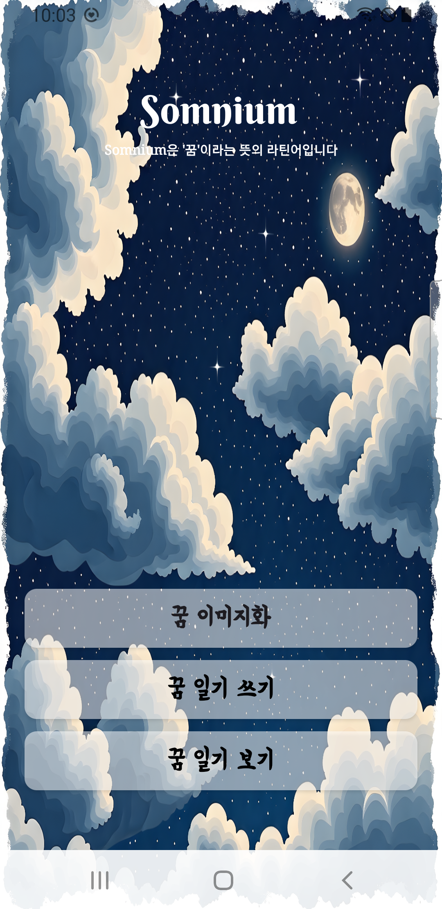
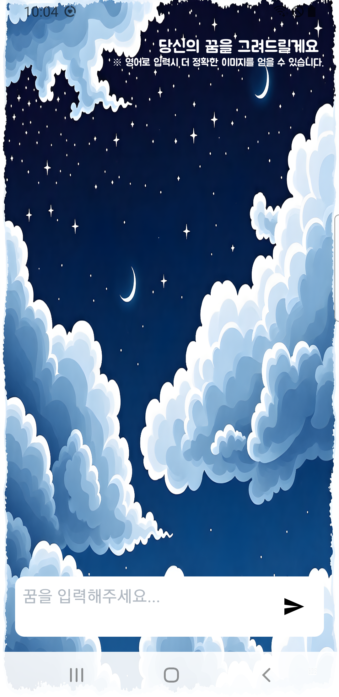
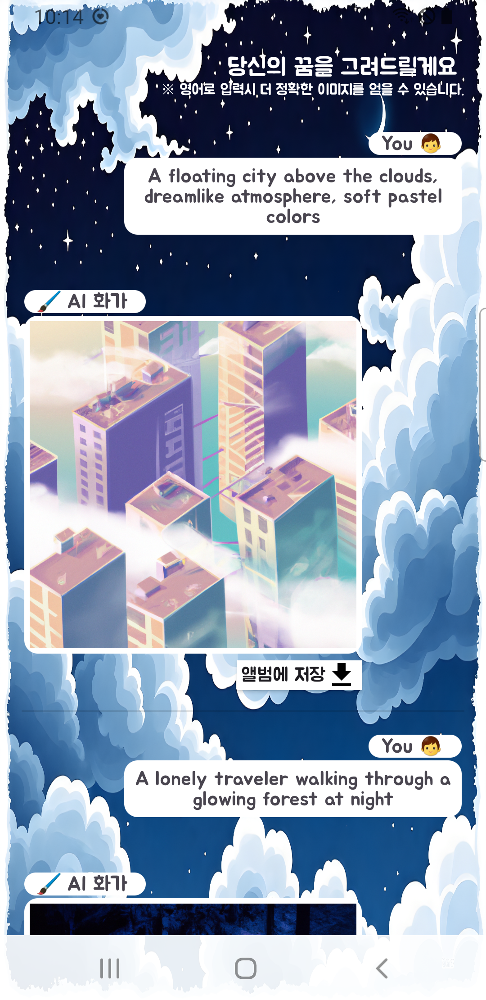
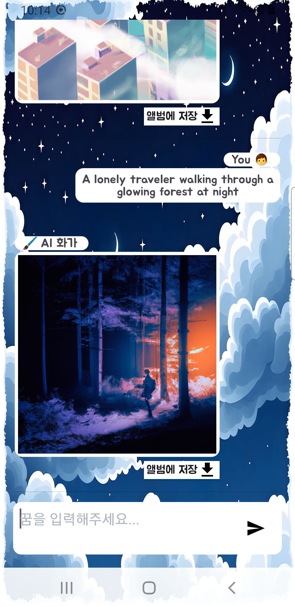
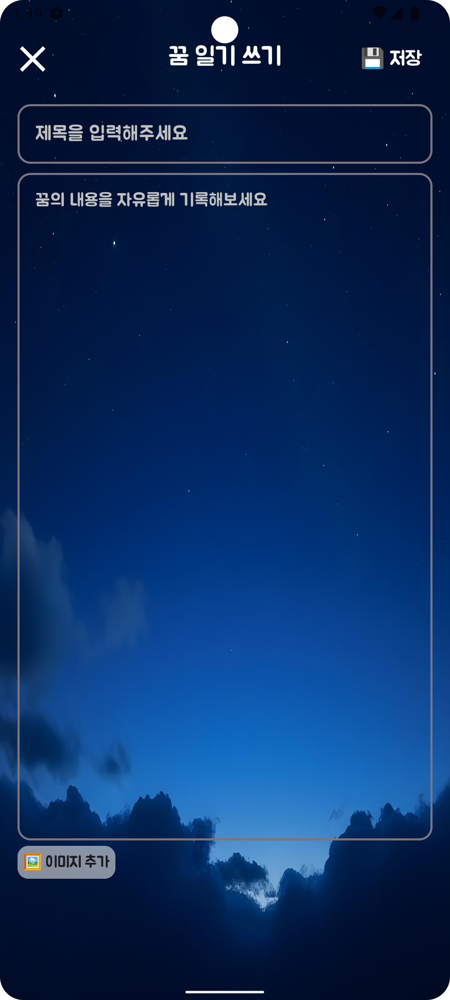
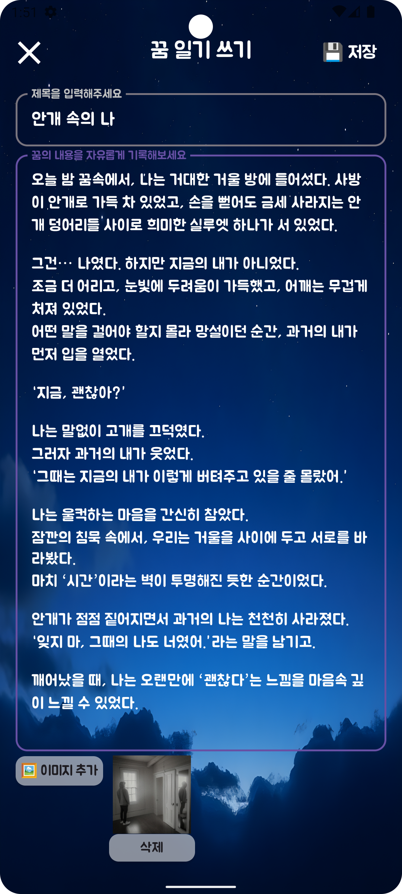
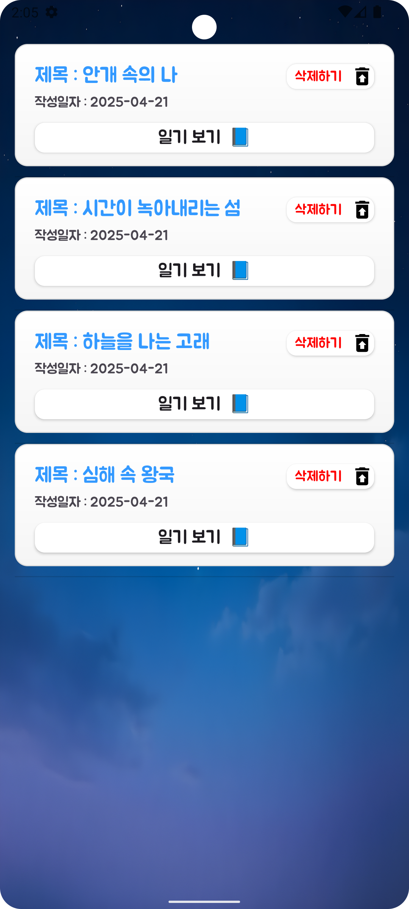
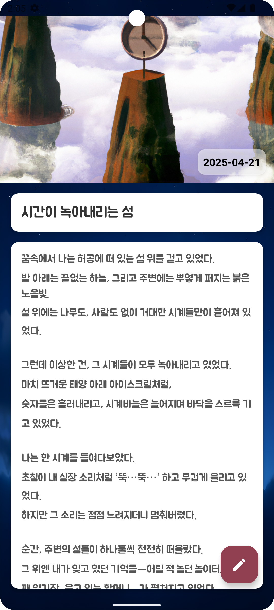
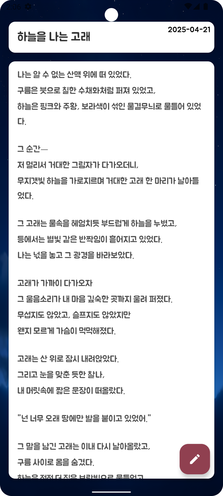

# 🌙 Project Name : Somnium

## 📌 설명  
**Somnium**은 사용자가 꾼 **꿈의 내용을 글로 작성하면**, OpenAI의 **DALL·E 모델**을 통해 그 꿈에 어울리는 이미지를 자동 생성해주는 **꿈 일기 앱**입니다.  
생성된 이미지를 배경으로 일기를 작성하며, 자신만의 몽환적인 꿈 일기장을 만들어 갈 수 있습니다.

---

## ✨ 주요 기능

### 🎨 AI 이미지 생성 (DALL·E)
- 사용자가 입력한 꿈 내용을 바탕으로 OpenAI의 **DALL·E 모델을 통해 이미지 생성**
- 생성된 이미지를 기반으로 꿈 일기를 작성할 수 있습니다.
  
### 📖 꿈 일기 작성/수정/삭제 기능  
- **텍스트 + 이미지 조합**으로 일기 작성  
- 작성된 꿈 일기는 목록에서 확인 및 편집 가능  

### 📑 꿈 일기 리스트 및 상세 보기
- RecyclerView를 통해 **꿈 일기 목록 표시**
- 각 일기를 클릭하면 **상세 보기 화면으로 이동**, 이미지와 내용을 확인할 수 있습니다.
- Glide 라이브러리를 이용한 **이미지 로딩 최적화**

---

## 🛠️ 기술 스택

- **언어 (Languages)**: Kotlin, XML  
- **개발 환경**: Android Studio  
- **라이브러리 (Libraries)**:  
  - **Room** - 꿈 일기 로컬 DB 저장  
  - **Retrofit 2** - Open API (DALL·E) 연동  
  - **Glide** - 이미지 로딩 최적화  
  - **Coroutines** - 비동기 처리 (IO → Main 스레드 전환 등)  
  - **RecyclerView** - 꿈 일기 리스트 구현  

---

## 🔄 앱 구조 및 흐름

```text
[입력] 꿈 내용 입력
   ↓
[API 요청] → DALL·E로 이미지 생성 요청 (Retrofit + 비동기 처리)
   ↓
[결과] 생성된 이미지 수신 후 Glide로 이미지 표시
   ↓
[저장] Room을 통해 이미지 URL + 텍스트 저장
   ↓
[목록] RecyclerView로 꿈 일기 리스트 표시
   ↓
[열람] 항목 클릭 시 ReadDiaryActivity로 이동하여 상세 정보 표시
```

---

## 🔍 핵심 기술 설명

### 📌 Room
- **로컬 데이터 저장** 을 위해 사용
- 일기 데이터 (제목, 내용, 이미지 URL, 날짜 등) 를 Entity로 구성
- IO 스레드에서 처리하여 UI 지연 방지

### 📌 Retrofit
- OpenAI DALL·E API 연동을 위해 사용
- 이미지 요청 → 응답까지 **비동기 처리**로 원활하게 진행
- 싱글톤 패턴으로 API 인스턴스 관리

### 📌 Glide
- DALL·E로부터 받은 이미지 URL을 **효율적으로 로딩**

### 📌 Coroutine
- `lifecycleScope.launch(Dispatchers.IO)`를 통해 Room과 Retrofit 작업 처리
- `withContext(Dispatchers.Main)`을 이용해 UI 업데이트

---

## 💡 유료 API (DALL·E) 사용 경험과 아쉬운점

이번 프로젝트에서 가장 큰 변화는, 기존의 **공공데이터 포털의 무료 API** 사용에서 벗어나 **처음으로 유료 API(OpenAI의 DALL·E)** 를 활용했다는 점입니다.

- API 요금 정책 등을 직접 경험하며 **실제 상용 서비스에서의 API 사용**을 고려한 개발을 진행했습니다.
- 이는 단순 기능 구현을 넘어서 **현실적인 기술 적용 겸험**을 할 수 있는 중요한 기회가 되었습니다.


## ❗ 아쉬운 점
- DALL·E API는 아직 한글 프롬프트에 대한 해석력이 부족하여, **한글로 입력된 내용은 원하는 이미지가 잘 생성되지 않는 경우**가 많았고
가끔은 영어로 작성하더라도 **기대한 이미지와 다르게 생성되는 경우**가 있었습니다.
- 향후에는 이미지 품질과 정확도를 높이기 위해 다른 이미지 생성 모델(예:Gemini Api - Gemini Vision 등)을 고려하거나,
프롬프트 전처리 및 번역 최적화를 적용해볼 수 있을 것 같습니다.

---

## 🛠 업데이트 25. 04. 28

- 메인 화면에 최근 작성한 꿈 일기의 썸네일을 표시하는 기능을 추가했습니다.
- 사용자가 최근에 기록한 꿈의 제목, 작성 날짜, 대표 이미지를 한눈에 확인할 수 있도록 구성했습니다.
- 썸네일 카드를 통해 꿈 내용을 간편하게 확인하고, "자세히 보기" 버튼으로 상세 페이지로 이동할 수 있습니다.

--- 

## ⚙ 코드 리팩토링 26. 05. 08

이번 리팩토링의 목표는 기존 프로젝트에  
**MVVM 아키텍처 패턴 적용** 및 **Hilt 기반 의존성 주입(DI)** 을 도입하여  
프로젝트의 유지보수성과 역할 분리를 개선하는 것이었습니다.

리팩토링은 아래 순서로 진행했습니다.

```text
기존 구조
   ↓
MVVM 패턴 적용
   ↓
Hilt 의존성 주입 적용
````

---

## 📌 MVVM 패턴 적용

기존에는 Activity가 UI 처리와 데이터 처리 로직을 함께 담당하고 있어
코드가 비대해질 가능성이 있었고, 역할 분리가 명확하지 않았습니다.

이를 개선하기 위해 MVVM 구조로 리팩토링을 진행했습니다.

### 🔄 변경 사항

* Activity → UI 처리 전담
* ViewModel → UI 상태 관리 및 비즈니스 로직 처리
* Repository → Room / Retrofit 데이터 처리 담당

---

### 📂 ViewModel 분리

화면별로 ViewModel을 분리하여 각 화면의 책임을 명확하게 구성했습니다.

| ViewModel               | 역할                      |
| ----------------------- | ----------------------- |
| `MainActivityViewModel` | 메인 썸네일 데이터 관리           |
| `DiaryListViewModel`    | 꿈 일기 목록 조회 및 삭제         |
| `ReadDiaryViewModel`    | 상세 일기 조회                |
| `WriteDiaryViewModel`   | 일기 저장 및 수정              |
| `MakeImageViewModel`    | OpenAI DALL·E 이미지 생성 처리 |

---

### 📌 Repository 패턴 적용

Room DB 및 Retrofit API 접근 로직을 Repository로 분리했습니다.

#### DiaryRepository

* Room 데이터 접근 담당
* Coroutine + IO Dispatcher를 통한 비동기 처리
* 데이터 CRUD 로직 캡슐화

#### GptRepository

* OpenAI API 요청 처리
* API 성공/실패 상태를 `Result<T>` 형태로 관리
* 네트워크 로직과 UI 로직 분리

---

### 📌 LiveData 기반 상태 관리

ViewModel에서 LiveData를 사용하여
UI가 데이터를 관찰(Observe)하는 구조로 변경했습니다.

```kotlin
viewModel.imageData.observe(this) { data ->
    recyclerDataModel.add(data)
    recyclerAdapter.notifyDataSetChanged()
}
```

이를 통해 데이터 변경 시 UI가 자동으로 갱신되도록 구성했습니다.

---

### 📌 Coroutine 적용 개선

기존의 단순 비동기 처리 방식에서 벗어나
Coroutine 기반 구조로 개선했습니다.

```kotlin
viewModelScope.launch {
    repo.insertData(data)
}
```

* `viewModelScope.launch`

  * Lifecycle 기반 Coroutine 처리
  * 메모리 누수 방지

* `Dispatchers.IO`

  * Room 및 Retrofit 작업을 백그라운드에서 처리
  * UI 지연 방지

---

## 📌 Hilt 의존성 주입(DI) 적용

MVVM 적용 이후에는 객체 생성 책임을 분리하기 위해
Hilt 기반 DI 구조를 도입했습니다.

---

### 🔄 기존 방식의 문제점

기존에는 Activity 또는 클래스 내부에서 객체를 직접 생성해야 했습니다.

```kotlin
val retrofit = Retrofit.Builder()...
```

이 방식은:

* 클래스 간 결합도가 높아지고
* 객체 관리가 어려우며
* 테스트 및 유지보수에 불리한 구조였습니다.

---

### ✅ Hilt 적용 후 개선점

Hilt를 적용하면서 객체 생성 책임을 외부로 분리했습니다.

```kotlin
@HiltViewModel
class MakeImageViewModel @Inject constructor(
    private val repository: GptRepository
) : ViewModel()
```

이를 통해:

* 객체 생성 코드 제거
* 의존성 관리 자동화
* 클래스 간 결합도 감소
* 유지보수성 향상

등의 개선 효과를 얻을 수 있었습니다.

---

## 📌 Module 구성

### DatabaseModule

* Room Database Singleton 관리
* DAO 객체 제공

### RetrofitModule

* Retrofit Singleton 관리
* OkHttpClient 설정
* LoggingInterceptor 적용
* Gson Converter 설정

---

## 📌 Activity 구조 개선

기존에는 Activity에서 데이터 처리 로직까지 담당할 가능성이 있었지만,
리팩토링 이후에는 UI 처리 역할만 담당하도록 구조를 변경했습니다.

```text
Activity
   ↓
ViewModel
   ↓
Repository
   ↓
Room / Retrofit
```

이를 통해:

* 역할 분리 명확화
* 코드 가독성 향상
* 유지보수성 개선
* 재사용성 증가

등의 효과를 얻을 수 있었습니다.

---

## 💡 리팩토링을 통해 배운 점

이번 리팩토링을 진행하면서 단순히 기능을 구현하는 것과  
구조를 고려하며 프로젝트를 설계하는 것은 큰 차이가 있다는 점을 느낄 수 있었습니다.

처음 리팩토링을 진행하기 전에는 여러 로직들이 하나의 Activity 내부에 섞여 있었고,  
직접 만든 프로젝트임에도 프로젝트 흐름과 구조를 다시 파악하는 데 시간이 걸렸습니다.

하지만 MVVM 패턴을 적용하면서  
UI 처리, 데이터 처리, 비즈니스 로직의 역할이 분리되기 시작했고,  
각 클래스가 어떤 역할을 담당하는지 이전보다 훨씬 명확하게 보이기 시작했습니다.

특히:
- Activity는 UI 처리
- ViewModel은 상태 관리
- Repository는 데이터 처리

처럼 역할이 나뉘면서  
기능 수정이나 유지보수를 진행할 때 어디를 수정해야 하는지 빠르게 파악할 수 있었고,  
MVVM과 같은 아키텍처 구조의 중요성을 직접 체감할 수 있었습니다.

또한 이후 Hilt를 적용하면서  
Retrofit, Room Database 같은 객체를 직접 생성하지 않고 필요한 곳에서 주입받는 구조로 변경할 수 있었고,  
객체 생성 코드가 줄어들면서 코드 흐름도 이전보다 훨씬 깔끔해졌습니다.

이번 리팩토링 경험을 통해  
단순히 동작하는 앱을 만드는 것을 넘어,  
유지보수성과 확장성을 고려한 구조 설계가 왜 중요한지 배울 수 있었습니다.

---

<br> <br> <br>
## 실행 화면 (Screenshots & GIFs)

<h3>메인 화면</h3>
<table>
  <tr>
    <th>메인화면</th>
    <th>썸네일 GIF</th>
  </tr>
  <tr>
    <td></td>
    <td></td>
  </tr>
</table>


<h3>🎨 AI 이미지 생성 (DALL·E)</h3>

<table>
  <tr>
    <td></td>
    <td></td>
    <td></td>
  </tr>
</table>

<table>
  <tr>
    <th>실행 GIF</th>
  </tr>
  <tr>
    <td></td>
  </tr>
</table>


<br>
<h3>🖊 일기 쓰기 </h3>

<table>
  <tr>
    <td></td>
    <td></td>
  </tr>
</table>

<table>
  <tr>
    <th>실행 GIF</th>
  </tr>
  <tr>
    <td></td>
  </tr>
</table>


<br> <br>

<h3>📖 일기 보기 </h3>
<table>
   <tr>
    <th>일기 목록</th>
    <th>사진이 있는 일기</th>
    <th>사진이 없는 일기</th>
  </tr>
   <tr>
    <td></td>
    <td></td>
    <td></td>
  </tr>
</table>
  
<table>
  <tr>
    <th>실행 GIF</th>
  </tr>
  <tr>
     <td></td>
  </tr>
</table>

---

본 프로젝트는 학습 및 포트폴리오 용도로 제작되었습니다.
